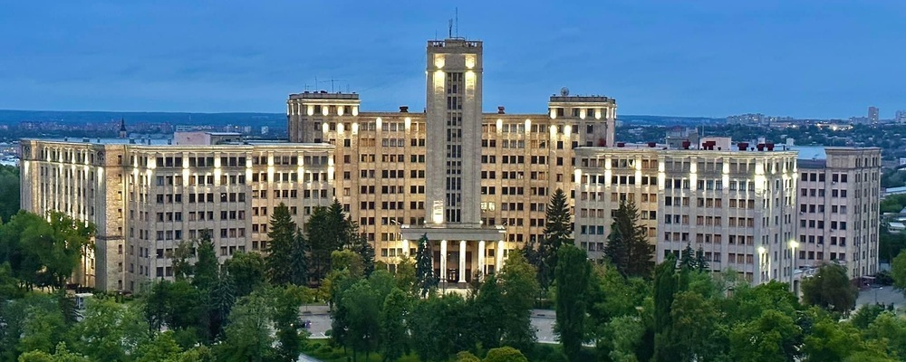

# :spiral_notepad: Завдання

Додати вна ваш імпровізрованний сайт 3 зображення:

- Ваше власне фото
- Фотографію будівлі ХНУ до війни
- Іконку для позначення переходу назад.

Малюнок іконки виконати самостійно в будь-якому графічному редакторі.

## :white_check_mark: Відповідь

1. **Фото університету.** Додамо наступний HTML код:

    ```html
    <!-- Some code above --->
    
    <!-- Some code below --->
    ```

    Також додамо наступний CSS код:
    
    ```css
    .university {
        display: block;
        width: 50%;
        margin-left: auto;
        margin-right: auto;
    }
    ```

2. **Фото переходу назад:**

    Додамо наступний HTML код:
    
    ```html
    <!-- Some code above --->
    <p class="back"><a href="index.html"> Return to the main page</a></p>
    <!-- Some code below --->
    ```

    З відповідним CSS кодом:
    
    ```css
    .back-img {
        width: 20px;
        height: 20px;
    }
    ```

3. **Персональна фотографія.** Додамо наступний HTML код:

    ```html
    <!-- Some code above --->
    
    <!-- Some code below --->
    ```

    Також додамо наступний CSS код:
    
    ```css
    .personal-photo {
        display: block;
        width: 15%;
    }
    ```
