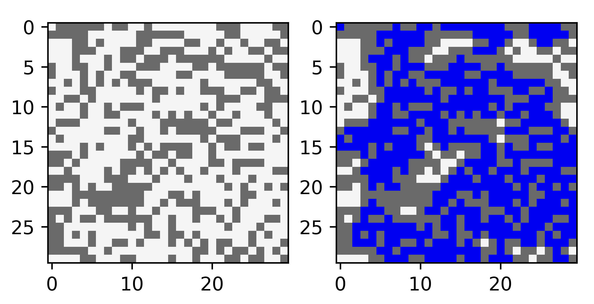

# Homework :one:

## :memo: Problem Statement

Given a grid of size $n \times n$ (where $n$ might change from one test case to another), and the probability of each cell to be an obstacle $p$, write a program to model the grid and deduce whether the percolation occurs: that is, whether there is a path from the top to the bottom of the grid.



## :runner: How to run?

To view all the available commands, run the following command:

```bash

python3 cli.py --help

```

The following table shows the available commands and their descriptions:
| Command | Params | Description |
| --- | --- | --- |
| `python3 cli.py instant-fill` | `--size`: grid size; `--p`: probability $p$ from the problem statement | Immediately calculates the ultimate configuration and plots it. |
| `python3 cli.py animation-fill` | `--size`: grid size; `--p`: probability $p$ from the problem statement | Does the same thing as `instant-fill`, but shows the animation instead. |
| `python3 cli.py analyze-depth` | `--size`: grid size; `--min-p,max-p,steps`: $p$ limits and number of segments, respectively; `experiments`: how many experiments to run per chosen $p$; `fig_save_path`: where to save the plot. | Benchmarks the program and shows the results. |

## :technologist: Code organization

The code is organized as follows:

- [`cli.py`](cli.py): the command-line interface to run the program.
- [`tile.py`](tile.py): module with the `Tile` class, which represents a cell in the grid.
- [`grid.py`](grid.py): module with the `Grid` class, which represents the grid itself and contains all the core logic.
