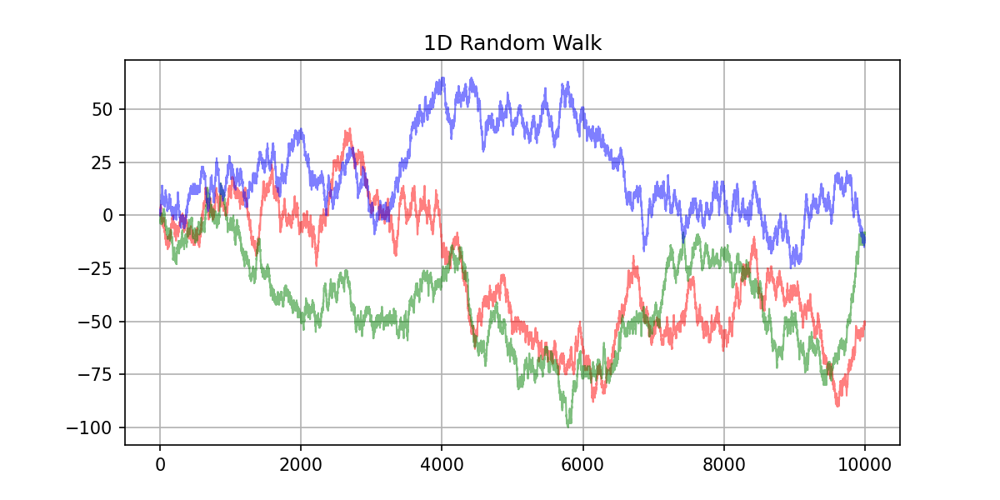

# :walking: Random walks

This is a simple implementation of random walks in Python.

At each step, with probability $\frac{1}{2}$, the walker moves one step to the right, and with probability $\frac{1}{2}$, the walker moves one step to the left.

The walker starts at the origin, and the number of steps is a parameter.

All the code is in the file [`cli.py`](cli.py). Here, we conduct three experiments:

- Simply displaying the random walks: `python3 cli.py show-random-walk`.
- Calculating the ratio of time the distance from origin is positive: `python3 cli.py positive-y-experiment --histogram-density=100 --experiments-number=100000`.
- Calculating the number of switches in the random walk: `python3 cli.py switches-number-experiment --histogram-density=100 --experiments-number=10000`.
